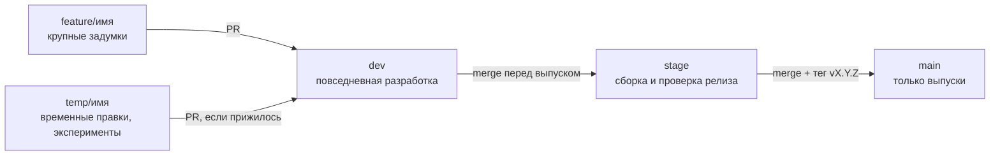

# Правила работы с ветками

## `dev`

- Основная ветка для повседневной разработки.
- Мелкие и средние правки коммитятся сюда напрямую; каждый отправляемый
  коммит остаётся понятным и не содержит локальных конфигов, заявок,
  выгрузок или секретов.

## `stage`

- Предрелизная сборка: сюда вливается `dev`, когда решаем готовить выпуск.
- Напрямую в stage ничего не коммитится — только merge из `dev` (и hotfix-веток
  для срочных исправлений уже вышедшего релиза).
- Перед переходом в `main`: полный прогон тестов и линта, проверка запуска
  через `start.sh` / `start.bat` и рабочего сценария диагностики заявки.

## `main`

- Только целостные, законченные изменения — то, что уходит пользователям.
- Обновляется merge-ом из `stage` вместе с тегом `vX.Y.Z`: релизный workflow
  прогоняет тесты и публикует GitHub Release с исходниками.
- Прямые коммиты и пуш «мимо тега» не делаем.

## Крупные задумки — `feature/<имя>`

- Для каждой большой задумки — своя ветка от `dev`:
  `feature/ui-phase-1`, `feature/history-page`, `feature/new-module`.
- Крупная — это когда изменение затрагивает много файлов, заметно меняет
  поведение для пользователя или живёт дольше пары дней. Пример — фазы
  плана `docs/UI_PLAN.md`: одна фаза = одна ветка = один PR.
- Вливается в `dev` pull request-ом с описанием, а для интерфейса — со
  скриншотами светлой и тёмной темы. Большая задумка может приходить
  несколькими PR по частям.

## Временные правки — `temp/<имя>`

- Для экспериментов, быстрых заплаток и всего, что «попробуем — потом
  решим»: `temp/try-loki-labels`, `temp/hide-noise-block`.
- Живут недолго. Прижилось — PR в `dev` с нормальным описанием; не
  прижилось — ветка просто удаляется, история dev остаётся чистой.
- В `stage` и `main` не попадают никогда, даже «на минутку».

## Выпуск изменения

1. Разработать и проверить изменение (в `dev`, `feature/*` или `temp/*`).
2. Запустить `python -m pytest -q` и `python -m ruff check .`
   (зависимости — из `requirements-dev.txt`, как в CI).
3. Убедиться, что локальные данные и секреты не попали в Git.
4. Обновить затронутую документацию: `README.md`, при изменении архитектуры —
   `docs/ARCHITECTURE.md`, при изменении фронтенда — `docs/UI_PLAN.md`.
5. Влить `dev` в `stage`, прогнать полный набор тестов и проверить рабочий
   сценарий (запуск через `start.sh` / `start.bat`, диагностика заявки).
6. Влить `stage` в `main` и поставить тег `vX.Y.Z` — релиз соберётся и
   опубликуется автоматически.

Срочное исправление уже вышедшего релиза — ветка `hotfix/<имя>` от `main`;
после проверки вливается в `main` с отдельным тегом-патчем и обязательно
переносится обратно в `dev`, чтобы расхождение не копилось.

Рекомендация: в настройках репозитория на GitHub включить branch protection
для `main` и `stage` (запрет прямых пушей, обязательные проверки CI) —
правила выше тогда будут поддерживаться автоматически.
