# Архитектура l2tool

Документ описывает устройство сервиса целиком: точки входа, слои, потоки
данных, хранилища и модель безопасности. Схемы выполнены в Mermaid и
рендерятся на GitHub. При изменении архитектуры обновляйте этот файл вместе
с кодом.

## 1. Общий контекст

l2tool — локальный инструмент специалиста L2-поддержки. Он разбирает текст
заявки, нормализует телефоны, даты и регион, а затем собирает готовые ссылки
на Grafana и OpenSearch. Ключевая особенность: **сам инструмент не ходит в
Grafana и OpenSearch по API** — он только формирует URL; переход выполняет
браузер пользователя с его же правами и куками.

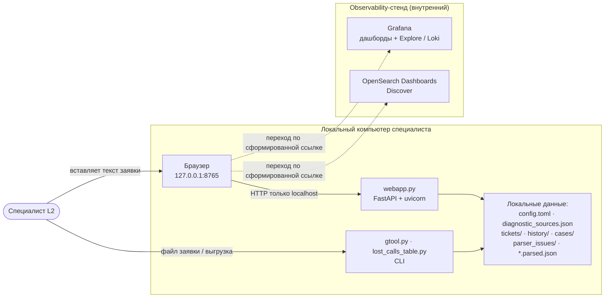

## 2. Слои и компоненты

Код разделён на три слоя. `core/` — доменная логика (разбор заявки, время,
история, экспорт), `services/` — сборка URL под конкретную платформу,
`modules/` — диагностические запросы: что и по каким полям искать в каждом
сервисе. Точки входа не зависят от реализации сервисов: CLI получает модули
через реестр `services/registry.py`, веб — переиспользует `run_ticket` из
`gtool.py`.

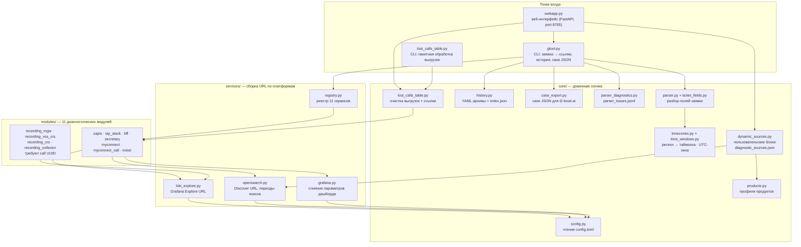

## 3. Разбор заявки (core/parser.py)

Парсер превращает произвольный текст заявки в словарь контекста `ctx`, на
котором работают все модули. Поля извлекаются построчными регулярками из
`ticket_fields.py`; номера нормализуются к формату `7XXXXXXXXXX`; даты и
времена поддерживаются в нескольких форматах, включая русские месяцы и
компактные даты `ddMMyyyy`.

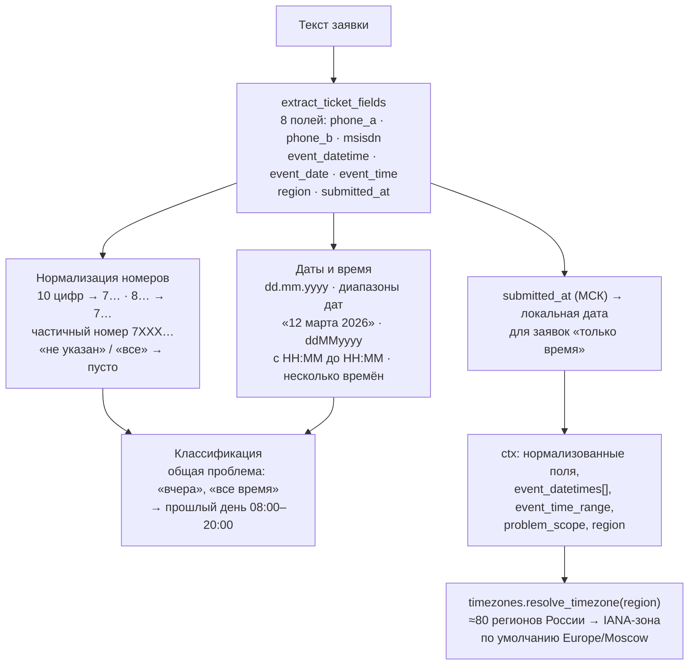

Результаты разбора проверяются `core/parser_diagnostics.py`: нераспознанные
номера и даты попадают в `parser_issues/parser_issues.jsonl`, а заявка без
корректных полей не доходит до сборки ссылок.

## 4. Поток веб-диагностики `/analyze`

Веб-форма отправляет текст заявки, продукт и окно поиска. Дальше развилка:
если для продукта созданы пользовательские блоки (`diagnostic_sources.json`),
работает динамический конструктор; иначе — статический профиль из
`config.toml` через модули.

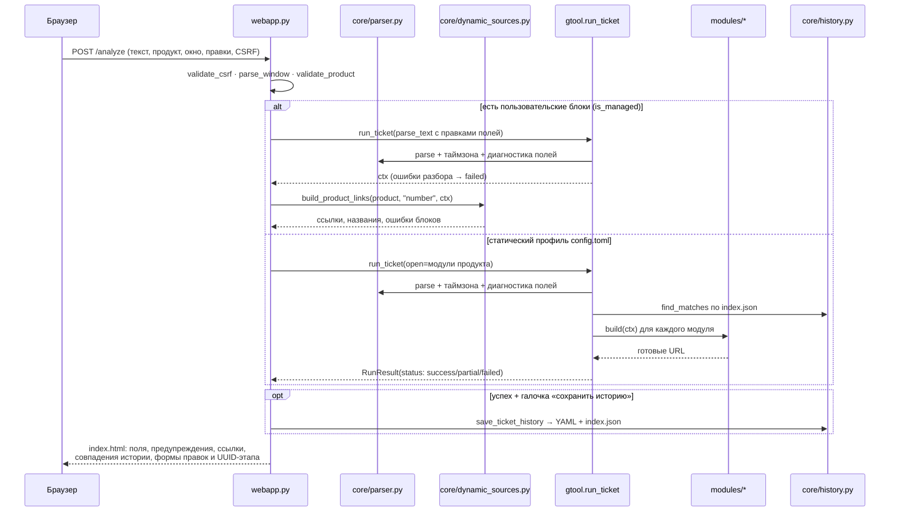

## 5. Динамические источники (конструктор блоков)

Страница «Настройки источников» позволяет собрать собственный диагностический
блок из одной вставленной ссылки. Ссылка классифицируется по платформе, в ней
находится пример номера или UUID, и сохраняется стратегия подстановки.

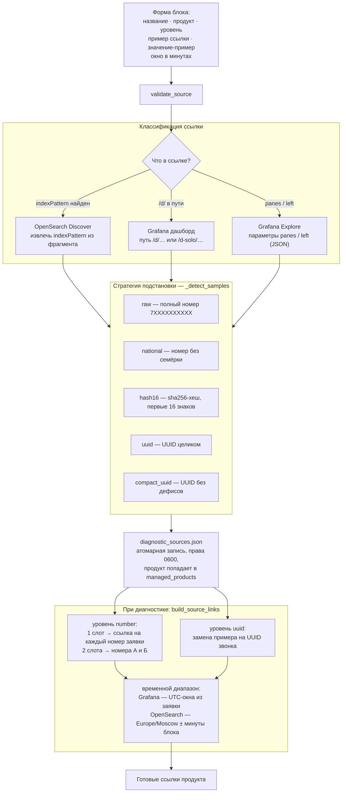

Импорт и экспорт конфигурации: экспорт отдаёт текущий `diagnostic_sources.json`
как скачиваемый файл; импорт валидирует все блоки целиком, добавляет новые и
пропускает точные дубликаты (совпадают название, продукт, уровень и ссылка).

## 6. Вторичная диагностика по UUID

После первичной диагностики продукта «Запись», когда UUID звонка уже найден,
запускается отдельный этап. Динамическим продуктам доступны их UUID-блоки;
статическому профилю «Запись» — цепочка модулей Loki.

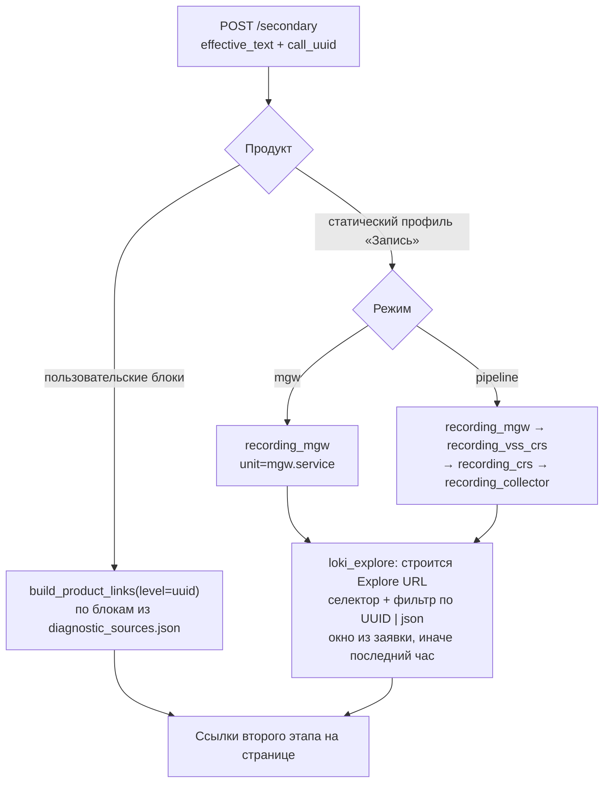

CLI-эквивалент: `gtool.py --open recording_mgw,… --call-uuid …`.

## 7. Пакетная обработка потерянных звонков

Отдельный сценарий для табличных выгрузок (XLSX, XLSM, CSV, TSV), доступный
из веба (`POST /batch`) и CLI (`lost_calls_table.py`).

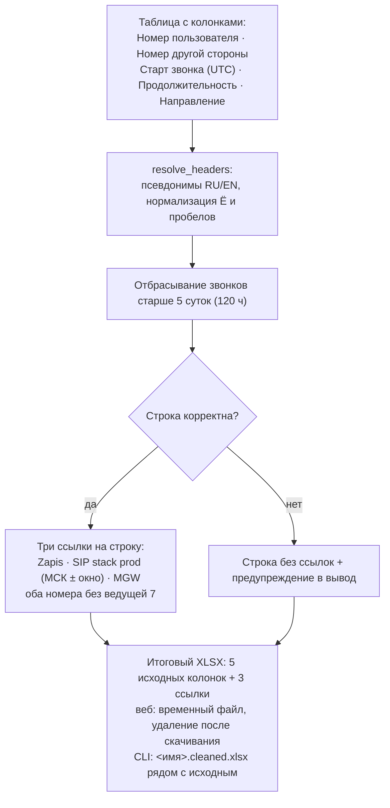

## 8. Реестр сервисов и модули

`services/registry.py` сопоставляет ключ сервиса платформе и модулю.
`SEARCH_PERIOD` модуля — период по умолчанию; `minutes_before` / `minutes_after`
из `config.toml` пересчитывают его относительно времени звонка.

| Ключ | Модуль | Платформа | Что ищет | Нужен UUID |
| --- | --- | --- | --- | --- |
| `zapis` | `find_call_in_logs` | Grafana дашборд | звонок по номерам А/Б, пары участников | — |
| `sip_stack` | `sip_stack_opensearch` | OpenSearch | логи SIP stack по `msisdn` | — |
| `bff` | `bff_logs_opensearch` | OpenSearch | логи BFF по хешу номера (sha256/16) | — |
| `secretary` | `secretary_loki` | Grafana Explore | логи Секретаря по номеру в фильтре | — |
| `myconnect` | `profile_not_found_myconnect` | OpenSearch | `profile not found` по `msisdn` + фраза | — |
| `myconnect_call` | `attached_call_myconnect` | OpenSearch | `master:<msisdn>` + участник SIP | — |
| `noise` | `noise_loki` | Grafana Explore | логи Шумоподавления по 10-значному номеру | — |
| `recording_mgw` | `recording_mgw` | Grafana Explore | `mgw.service` по UUID | да |
| `recording_vss_crs` | `recording_vss_crs` | Grafana Explore | `vss.service` по UUID | да |
| `recording_crs` | `recording_crs` | Grafana Explore | `crs.service` по UUID | да |
| `recording_collector` | `recording_collector` | Grafana Explore | контейнер collector по UUID | да |

Профили продуктов (`core/products.py`): `recording` → zapis, sip_stack, bff;
`secretary` → secretary; `calls` → myconnect, myconnect_call; `noise` → noise;
`assistant` → пусто. Первый пользовательский блок для продукта переводит его
в вебе на динамическую конфигурацию; `config.toml` остаётся для CLI.

## 9. Время и периоды поиска

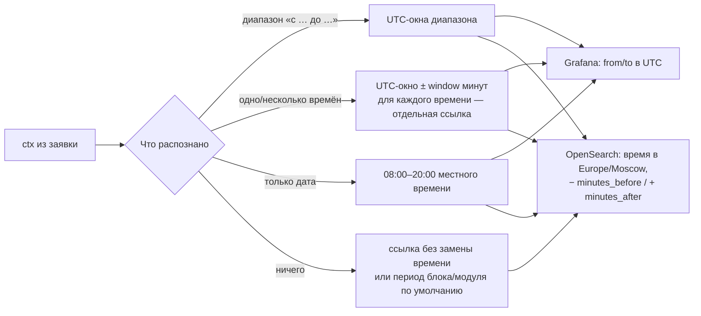

Отдельное предупреждение срабатывает, когда событие старше 5 суток: Loki хранит
логи только 5 дней.

## 10. Хранилища и локальные данные

Всё хранится на машине специалиста; перечисленные пути игнорируются Git.

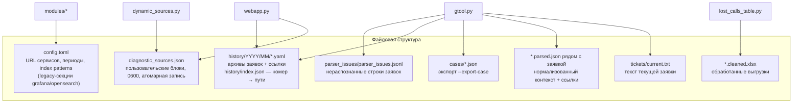

Case JSON (`core/case_export.py`) содержит нормализованные идентификаторы,
событие, выбранные модули и ссылки; исходный текст заявки, пути, токены и
конфигурация в него не попадают.

## 11. Маршруты веб-приложения

| Метод и путь | Назначение |
| --- | --- |
| `GET /` | главная: форма заявки, результаты, пакетная загрузка |
| `POST /analyze` | первичная диагностика заявки |
| `POST /secondary` | второй этап по UUID звонка |
| `POST /batch` | обработка таблицы потерянных звонков, скачивание XLSX |
| `GET /settings` | конструктор диагностических блоков |
| `POST /settings/source` | создание / сохранение блока |
| `POST /settings/source/delete` | удаление блока |
| `POST /settings/import` | импорт конфигурации из JSON |
| `GET /settings/export` | скачивание текущей конфигурации |
| `GET /healthz` | проверка живости |
| `GET /static/*` | styles.css, app.js |

Запуск: `.venv/bin/python webapp.py` (порт 8765, браузер открывается
автоматически; флаги `--port`, `--no-browser`).

## 12. Модель безопасности

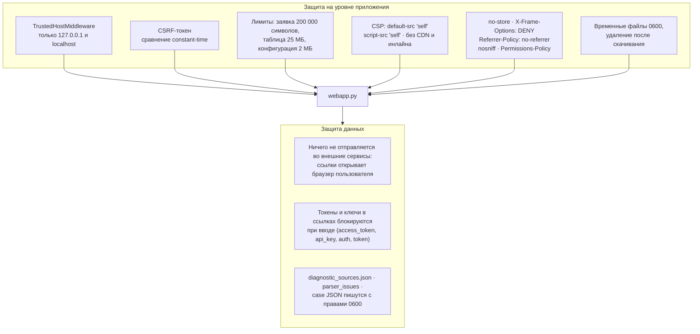

История успешных заявок выключена по умолчанию и включается галочкой;
`--dry-run` в CLI отключает и историю, и диагностику парсера.

## 13. Тесты, CI и ветки

- `tests/` — pytest по всем слоям: парсер, история, экспорт, ссылки сервисов,
  динамические источники, веб-маршруты (`TestClient` + `httpx`), таблицы.
- CI (`.github/workflows/ci.yml`): Python 3.12 → `ruff check .` → `pytest -q`.
- Локально: `python -m pip install -r requirements-dev.txt`,
  затем `python -m pytest -q` и `python -m ruff check .`.
- Ветки (`CONTRIBUTING.md`): `feature/*` и `temp/*` → PR в `dev`;
  перед выпуском `dev` вливается в `stage` (полная проверка), из `stage` —
  merge в `main` с тегом `vX.Y.Z`. Релизный workflow
  (`.github/workflows/release.yml`) на тег прогоняет тесты и публикует
  GitHub Release с исходниками.
- Текущие крупные задачи и их ветки — в `docs/tasks/`.

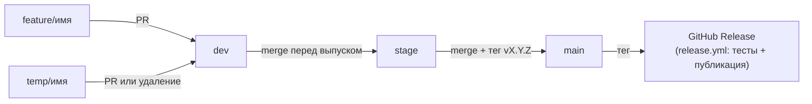
